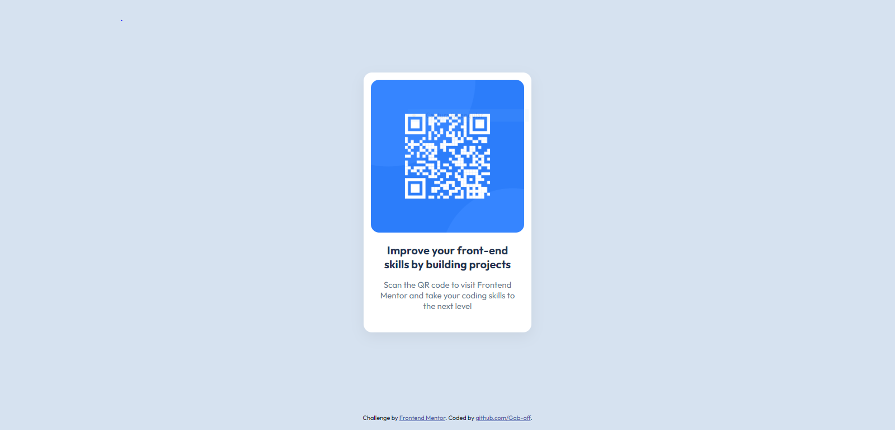

# Frontend Mentor - QR code component solution

This is a solution to the [QR code component challenge on Frontend Mentor](https://www.frontendmentor.io/challenges/qr-code-component-iux_sIO_H). Frontend Mentor challenges help you improve your coding skills by building realistic projects. 

## Overview

### Screenshot

### Links

- Solution URL: [https://github.com/Gab-off/frontendMentor-qr_code_component](https://github.com/Gab-off)
- Live Site URL: [https://gab-off.github.io/frontendMentor-qr_code_component/](https://your-live-site-url.com)

